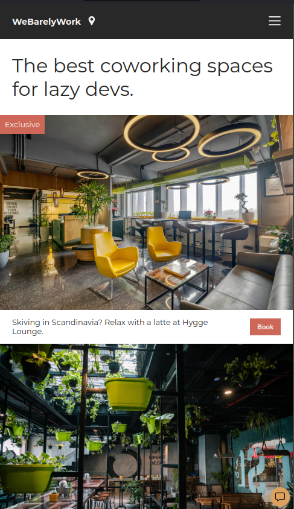

# Intro
This is one of the many projects I had to do at scrimba's frontend course.
It's about using css, and the project is a place where people could book workplaces.

# Run it
Open the `index.html` file, while the rest of the files of the project are in the same folder.
