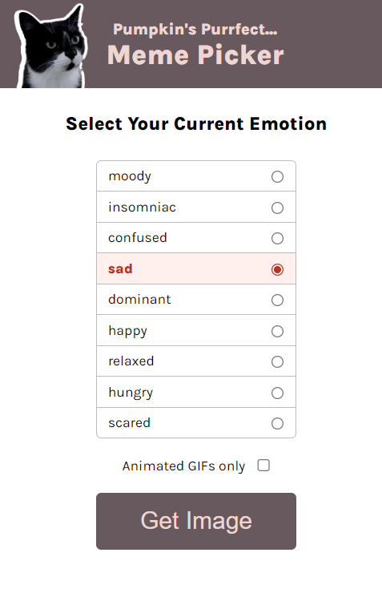

# Intro
This is one of the many projects I had to do at scrimba's frontend course.
It's about using javascript, and the project is about picking a random cat image/gif based on user specified criteria

# Run it
Open the `index.html` file, while the rest of the files of the project are in the same folder.
