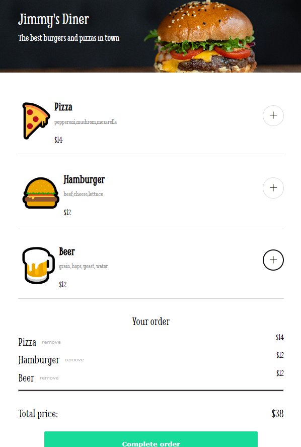

# Intro
This is one of the many solo projects I had to do at scrimba's frontend course.
It's about using javascript, and the project is a simple food purchasing app

# Run it
Open the `index.html` file, while the rest of the files of the project are in the same folder.

OR
Try it at [https://food-app-expp.netlify.app/](https://food-app-expp.netlify.app/)