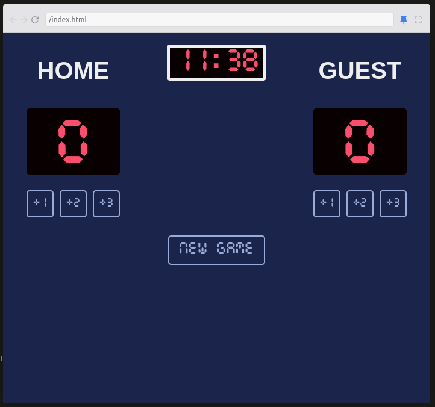

# Intro
This is one of the many projects I had to do at scrimba's frontend course.
It's about using javascript, and the project consists of a score tracker and a timer for a basketball game.

# Run it
Just open the `index.html`, and make sure the rest of the files are in the same folder. 🚀

OR

Test it here `https://expp121-basketball.netlify.app/`.