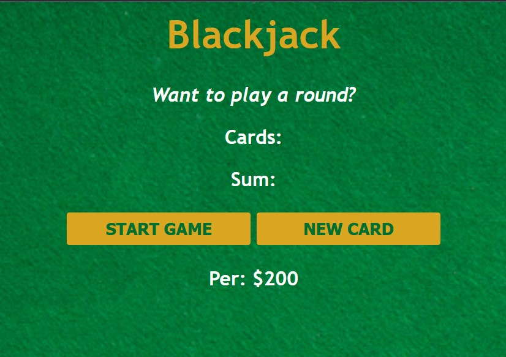

# Intro
This is one of the many projects I had to do at scrimba's frontend course.
It's about using javascript, and the project consists of a 4 text fields which display information. Mainly the first is about whether you want to draw a card, are aut of the game, or got blackjack. The second one, shows your cards, and the third their sum.

There are also buttons to start new game and to draw a new card.

# Run it
Just open the `index.html`, and make sure the rest of the files are in the same folder. 🚀

OR

Test it [https://scrimba-black-jack.netlify.app/](https://scrimba-black-jack.netlify.app/).