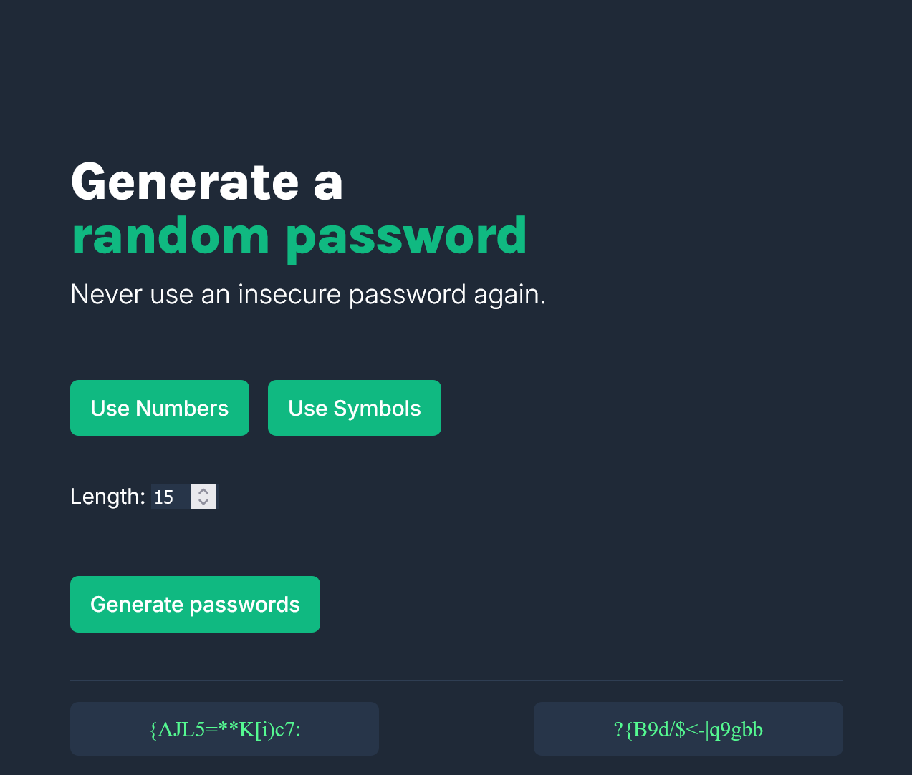

# Intro
This is one of the many projects I had to do at scrimba's frontend course.
It's about using javascript, and the project is a random password generator with some features such as chosing the length of the password, use numbers/symbols.

# Run it
Just open the `index.html`, and make sure the rest of the files are in the same folder. 🚀

OR

Test it [https://scrimba-random-password.netlify.app/](https://scrimba-random-password.netlify.app/).