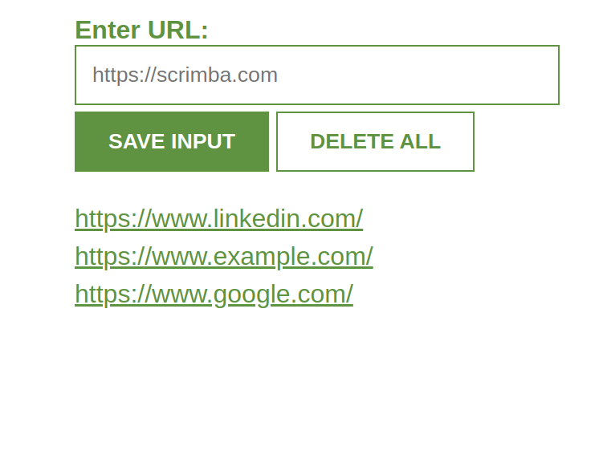

# Intro
This is one of the many projects I had to do at scrimba's frontend course.
It's about using javascript, and the project is a lead tracker, helping you save important links.
It uses firebase under the hood.

# Run it
In the `index.js` file, change the value of `databaseURL`, to the url of your realtime firabase database, and also make the database publicly readable and writable(BAD PRACTICE).

Then open the `index.html`, and make sure the rest of the files are in the same folder. 🚀
