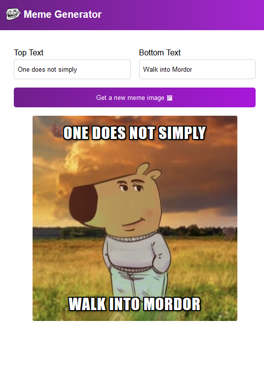

# Intro
This is one of the many projects I had to do at scrimba's frontend course.
It's about learning react and the project aims to teach me the basics of react.
The app is about generating memes with text



# Run it
Install the dependencies and run the project
```
npm install
npm start
```
OR
Try it at [https://react-meme-expp.netlify.app/](https://react-meme-expp.netlify.app/)