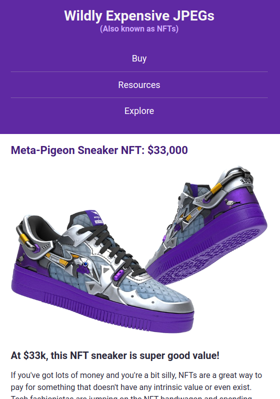

# Intro
This is one of the many projects I had to do at scrimba's frontend course.
It's about using responsive design, and the application is about NFTs

# Run it
Open the `index.html` file, while the rest of the files of the project are in the same folder.

OR
Try it at [https://responsive-nft-expp.netlify.app/](https://responsive-nft-expp.netlify.app/)