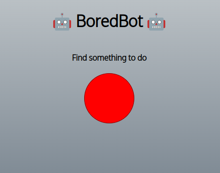

# Intro
This is one of the many projects I had to do at scrimba's frontend course.
It's about using the usage of APIs with Javascript, and this particular project is about a bot which gives you tasks when you are bored.

# Run it
Open the `index.html` file, while the rest of the files of the project are in the same folder.

OR
Try it at [https://api-bb-expp.netlify.app/](https://api-bb-expp.netlify.app/)