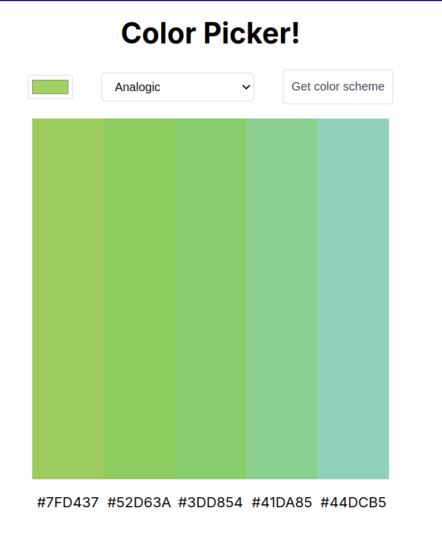

# Intro
This is one of the many projects I had to do at scrimba's frontend course.
It's about using the usage of APIs with Javascript, and this particular project is about a picking a color 4 colors based on user selection.
It used the `thecolorapi.com` API under the hood to get colors

# Run it
Open the `index.html` file, while the rest of the files of the project are in the same folder.

OR
Try it at [https://api-colors-expp.netlify.app/](https://api-colors-expp.netlify.app/)