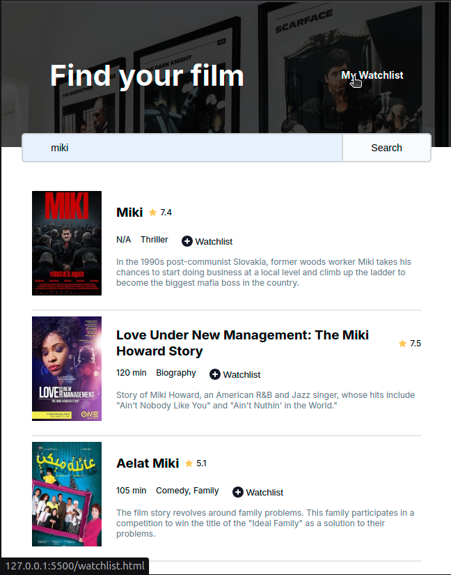

# Intro
This is one of the many solo projects I had to do at scrimba's frontend course.
It's about using the usage of APIs with Javascript, and this particular project is trying to keep track of the movies you want to watch.
It uses the OMDB API (I know about the key), to querry and get data about the searched movie.

# Run it
Open the `index.html` file, while the rest of the files of the project are in the same folder.

OR
Try it at [https://api-movies-expp.netlify.app/](https://api-movies-expp.netlify.app/)